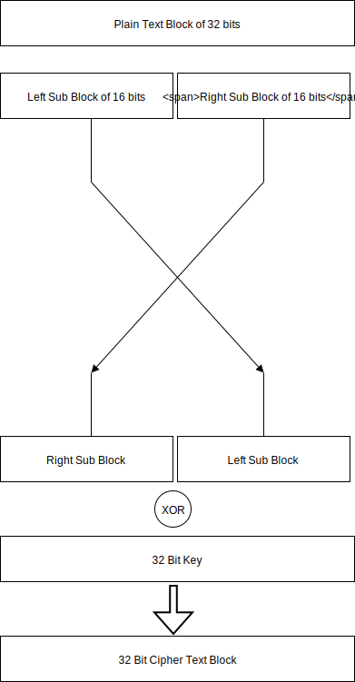

# Fest Cipher
### Working
Fest is a 32 bit block cipher based that employs a Feistel Network to encrypt and decrypt data. Its working is described in the diagram below.

### Foot notes
This is purely an experimental design for academic purposes. By no means with today's standards is this a secure implementation or design that can be practically used in any imaginable application small or big. **DO NOT USE THIS IN PURPOSES OTHER THAN ACADEMIC**. 

That'll be it. Any suggestion with regard to design or implementation are welcome. Peace.